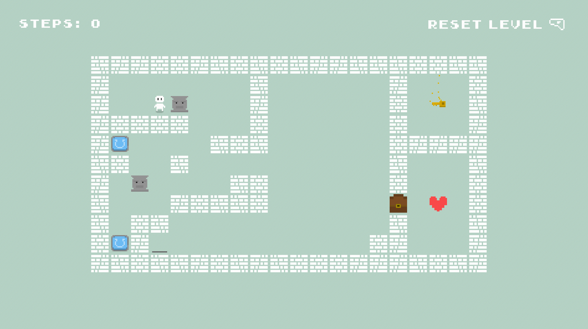

# LinusTinyAdventure

Linus tiny adventure is a 2D puzzle made with Godot engine by @NighlightStudios
as an example of how to use the engine for the "Road to Godot" internal course.

The road to godot is a course made by us to teach how to use the Godot engine
to make games. It's a course made for our team, but we decided to make the game
public so anyone can use it as a reference.

